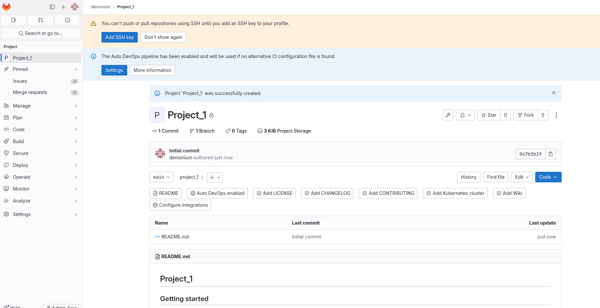

# Автор: Федорчук Дмитрий Сергеевич DEVOPS-33

# Домашнее задание к занятию «GitLab»

## Подготовка к выполнению


1. Или подготовьте к работе Managed GitLab от yandex cloud [по инструкции](https://cloud.yandex.ru/docs/managed-gitlab/operations/instance/instance-create) .
Или создайте виртуальную машину из публичного образа [по инструкции](https://cloud.yandex.ru/marketplace/products/yc/gitlab ) .
2. Создайте виртуальную машину и установите на нее gitlab runner, подключите к вашему серверу gitlab  [по инструкции](https://docs.gitlab.com/runner/install/linux-repository.html) .

3. (* Необязательное задание повышенной сложности. )  Если вы уже знакомы с k8s попробуйте выполнить задание, запустив gitlab server и gitlab runner в k8s  [по инструкции](https://cloud.yandex.ru/docs/tutorials/infrastructure-management/gitlab-containers). 

4. Создайте свой новый проект.
5. Создайте новый репозиторий в GitLab, наполните его [файлами](./repository).
6. Проект должен быть публичным, остальные настройки по желанию.

## Основная часть

### DevOps

В репозитории содержится код проекта на Python. Проект — RESTful API сервис. Ваша задача — автоматизировать сборку образа с выполнением python-скрипта:

1. Образ собирается на основе [centos:7](https://hub.docker.com/_/centos?tab=tags&page=1&ordering=last_updated).
2. Python версии не ниже 3.7.
3. Установлены зависимости: `flask` `flask-jsonpify` `flask-restful`.
4. Создана директория `/python_api`.
5. Скрипт из репозитория размещён в /python_api.
6. Точка вызова: запуск скрипта.
7. При комите в любую ветку должен собираться docker image с форматом имени hello:gitlab-$CI_COMMIT_SHORT_SHA . Образ должен быть выложен в Gitlab registry или yandex registry.   

### Product Owner

Вашему проекту нужна бизнесовая доработка: нужно поменять JSON ответа на вызов метода GET `/rest/api/get_info`, необходимо создать Issue в котором указать:

1. Какой метод необходимо исправить.
2. Текст с `{ "message": "Already started" }` на `{ "message": "Running"}`.
3. Issue поставить label: feature.

### Developer

Пришёл новый Issue на доработку, вам нужно:

1. Создать отдельную ветку, связанную с этим Issue.
2. Внести изменения по тексту из задания.
3. Подготовить Merge Request, влить необходимые изменения в `master`, проверить, что сборка прошла успешно.


### Tester

Разработчики выполнили новый Issue, необходимо проверить валидность изменений:

1. Поднять докер-контейнер с образом `python-api:latest` и проверить возврат метода на корректность.
2. Закрыть Issue с комментарием об успешности прохождения, указав желаемый результат и фактически достигнутый.

## Итог

В качестве ответа пришлите подробные скриншоты по каждому пункту задания:

- файл gitlab-ci.yml;
- Dockerfile; 
- лог успешного выполнения пайплайна;
- решённый Issue.

---

## Подготовка к выполнению

1. Создал инстанс с gitlab:


2. Создал виртуальную машину для GitLab Runner:


Установил GitLab Runner и подключил его к GitLab Server:


4. Создал новый проект:



5. Добавил в репозиторий файл:


6. Сделал репозиторий публичным:


## Выполнение основной части

---

### DevOps

Для выполнения этой части задания, в репозиторий нужно добавить файл `requirements.txt`, из которого будут устанавливаться зависимости `flask, flask_restful, flask_jsonpify` и `Dockerfile` для сборки образа на основе Centos 7 с выполнением python-скрипта:


Ссылка на файл `requirements.txt`: https://github.com/DemoniumBlack/fedorchukds-devops-33-26/blob/main/SRC/requirements.txt

Ссылка на файл `Dockerfile`: https://github.com/DemoniumBlack/fedorchukds-devops-33-26/blob/main/SRC/Dockerfile

Файл GitLab CI/CD `.gitlab-ci.yml` для автоматизации процесса сборки выглядит следующим образом: 

```
stages:
    - build
    - deploy
image: docker:20.10.5
services:
    - docker:20.10.5-dind
builder:
    stage: build
    script:
        - docker build -t $CI_REGISTRY/$CI_PROJECT_PATH/hello:gitlab-$CI_COMMIT_SHORT_SHA .
    except:
        - main
deployer:
    stage: deploy
    script:
        - docker build -t $CI_REGISTRY/$CI_PROJECT_PATH/hello:gitlab-$CI_COMMIT_SHORT_SHA .
        - docker login -u $CI_REGISTRY_USER -p $CI_REGISTRY_PASSWORD $CI_REGISTRY
        - docker push $CI_REGISTRY/$CI_PROJECT_PATH/hello:gitlab-$CI_COMMIT_SHORT_SHA
    only:
        - main

```

Ссылка на файл: https://github.com/DemoniumBlack/fedorchukds-devops-33-26/blob/main/SRC/.gitlab-ci.yml

Также потребовалось добавить переменные в GitLab Variables:


Выполняю процесс сборки проекта, запустив Pipeline. Проверю результат:


Сборка завершилась успешно, Docker образ был выложен в GitLab Registry:


Проверю, действительно ли образ находится в GitLab Registry. Для этого в GitLab перехожу в Project -> Deploy -> Container Registry и вижу там образ:


---

### Product Owner

Для выполнения этой части задания, создаю Issue с указанием метода, в котором необходимо исправление, а также указываю, какой текст нужно изменить. Также создаю новый label: feature. Результат создания Issue:


---

### Developer

Для выполнения этой части задания, создаю в Issue отдельную ветку с именем `message_edit`, в которой редактирую файл `python-api.py`, а именно, исправляю в нем текст сообщения и метод вызова GET:


Создаю Merge Request с вливанием необходимых изменения в ветку main, проверяю, что сборка прошла успешно:


После выполнения Merge можно посмотреть Commit и убедиться, что изменения влиты и сборка завершена успешно:


---

### Tester

Для выполнения этой части задания, запущу docker-контейнер с образом `python-api:latest` и проверю возврат метода на корректность:


Также можно для проверки использовать браузер, перейдя по ссылке http://localhost:5290/rest/api/get_info:


Закрываю Issue с желаемым результатом:


